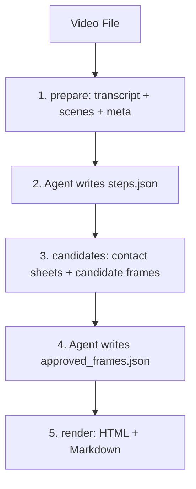

# BJJ Review Sheet Skill

This tool turns a BJJ instructional video plus subtitles into a student-facing review sheet in HTML and Markdown. The pipeline is split into five stages:



The script stages do the mechanical work: subtitle cleaning, scene detection, frame sampling, filtering, contact-sheet generation, and final rendering. The agent stages are manual judgment steps: segmenting the transcript into teaching steps and selecting the best frames from contact sheets.

## Dependencies

- Python 3.9 or newer
- `pip install -r requirements.txt`
- `ffmpeg` and `ffprobe` on your PATH
- Optional: `tesseract` for title-card filtering

On macOS, `ffmpeg` and `ffprobe` are usually easiest to install with:

```bash
brew install ffmpeg
```

Environment overrides:

- `BJJ_FFMPEG`
- `BJJ_FFPROBE`
- `BJJ_TESSERACT`

**Optional tools:**

- `yt-dlp` — only needed for URL input (Stage 0, downloading a YouTube/Bilibili video
  instead of starting from a local file). Install with `pip install yt-dlp`, or use the
  standalone binary from github.com/yt-dlp/yt-dlp.
- `openai-whisper` — only needed for videos with no subtitle file (Stage 1.5, ASR
  transcription). Install with `pip install openai-whisper`; it needs `ffmpeg` on PATH
  and pulls in PyTorch, so a dedicated virtualenv/conda env is recommended.

Only download or transcribe content you have the right to use for personal study.

## Install

Copy the `bjj-review-skill/` folder into your Codex or Claude skill location.

- Claude Code: copy the folder to `~/.claude/skills/bjj-review-sheet/`
- Codex: reference `SKILL.md` from your `AGENTS.md`
- Gemini CLI: reference it from your `GEMINI.md`

The model you use must support image input, since the judging stage requires looking at JPEG contact sheets.

## Example Session

```bash
export SKILL_DIR="$HOME/path/to/bjj-review-skill"
python3 "$SKILL_DIR/scripts/bjj_breakdown.py" prepare --video "/path/to/video.mp4"
```

Then the agent should:

1. Read `transcript.json` and `scenes.json`
2. Write `steps.json`
3. Run `python3 "$SKILL_DIR/scripts/bjj_breakdown.py" check --video "/path/to/video.mp4" --what steps`

Next:

```bash
python3 "$SKILL_DIR/scripts/bjj_breakdown.py" candidates --video "/path/to/video.mp4"
```

Then the agent should:

1. Inspect each `contact_sheets/contact_step_NN.jpg`
2. Write `approved_frames.json`
3. Run `python3 "$SKILL_DIR/scripts/bjj_breakdown.py" check --video "/path/to/video.mp4" --what approved`

Finally:

```bash
python3 "$SKILL_DIR/scripts/bjj_breakdown.py" render --video "/path/to/video.mp4" --embed-images
```

Open the printed HTML file and verify the selected frames line up with the teaching steps.

## Output quality depends on the driving model

The two agent stages are judgment work, and the sheet is only as good as the judgment:

- **Segmentation** requires actually reading `transcript.json`. `check --what steps` prints grounding WARNINGs when the steps' wording does not match the transcript — a strong signal the agent invented content instead of reading. Never ship a sheet that was generated over those warnings.
- **Frame judging** requires a model that genuinely looks at the contact sheets. The `notes` field per step should describe each chosen frame; an agent that cannot fill it did not look.
- If your model is weak at vision, do stage 4 yourself: open `contact_sheets/contact_step_NN.jpg`, pick 2–4 cell letters per step, and write `approved_frames.json` by hand — the letters + timestamps are designed to be human-friendly.
- The script enforces what it can mechanically: `check --what approved` **fails** when picked
  frames come without `notes`, and **warns** when a demonstration/drill step has fewer than
  2 picks or when the median across those steps falls below 3 (the rubric targets 3–4).
  Treat those warnings as "the judging pass was too shallow" — re-judge the sheets, or do
  stage 4 by hand.
- Always do the final check in stage 5: open the HTML and confirm every picture matches its step (click any picture to enlarge it). On seminar footage, also confirm no picture shows random students drilling instead of the instructor's demonstration.

## Long videos: multiple techniques

When a video teaches several distinct techniques (typical past ~8–10 minutes), the agent writes an optional `techniques` grouping in Stage 2 alongside the per-step `technique` field, and the rendered HTML gets one tab per technique — with a stacked, fully-readable no-JS/print fallback so the page still works with JavaScript disabled or when printed. Single-technique videos are unaffected: omit `techniques` entirely (do not write a one-entry list) and the sheet renders exactly as before, with no tabs.

## Source-video links

Pass `--url` to `prepare` (the agent does this automatically for Stage 0 downloads) and the sheet's header links to the source video, every step card gets a "▶ Watch this step" button, and every frame caption becomes a "▶ MM:SS · watch" link that opens the video at that exact moment — the ▶ glyph marks everything that jumps to the video. YouTube and Bilibili URLs get `t=` deep links; any other site gets the header link only. `--url ""` clears a stored URL. Links always point at the online video, never the local file — the sheet is meant to be shared, and the embedded images already cover offline study.

## Troubleshooting

- Missing `ffmpeg` or `ffprobe`: install them or set `BJJ_FFMPEG` / `BJJ_FFPROBE`
- `candidates` says it "could not open video": the file is probably AV1-encoded (common for
  YouTube downloads) and your OpenCV build can't decode it. Re-download preferring H.264
  (see the SKILL.md Stage 0 format string), or transcode a proxy:
  `ffmpeg -i video.mp4 -vf scale=1280:720 -c:v libx264 -preset ultrafast -an proxy.mp4`,
  run `candidates` against the proxy, then `render` against the original (timestamps match)
- `check` exits with code 2: the agent-written JSON failed validation; read the reported JSON path and fix the file
- Stale results after editing the selection logic: rerun with `--force-refresh`
- "no subtitle file found": see SKILL.md Stage 0 (download subtitles for a URL with yt-dlp) or Stage 1.5 (transcribe the audio with Whisper when no subtitles exist)
- Whisper too slow: stay on `--model small` (or `--model tiny` for a quick draft) — a 30-minute video is still only minutes of CPU time on `small`
- Chinese/Bilibili videos: pass `--language zh` to Whisper so it doesn't guess, and expect the review sheet itself to come out in the language of instruction
